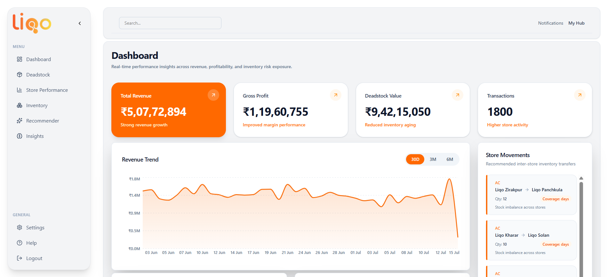
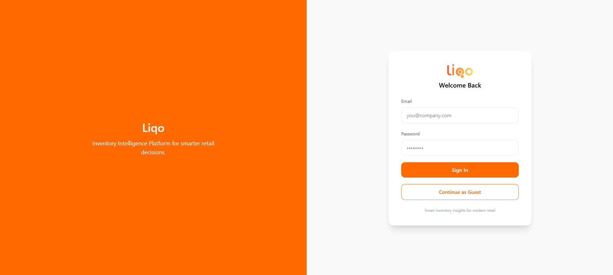
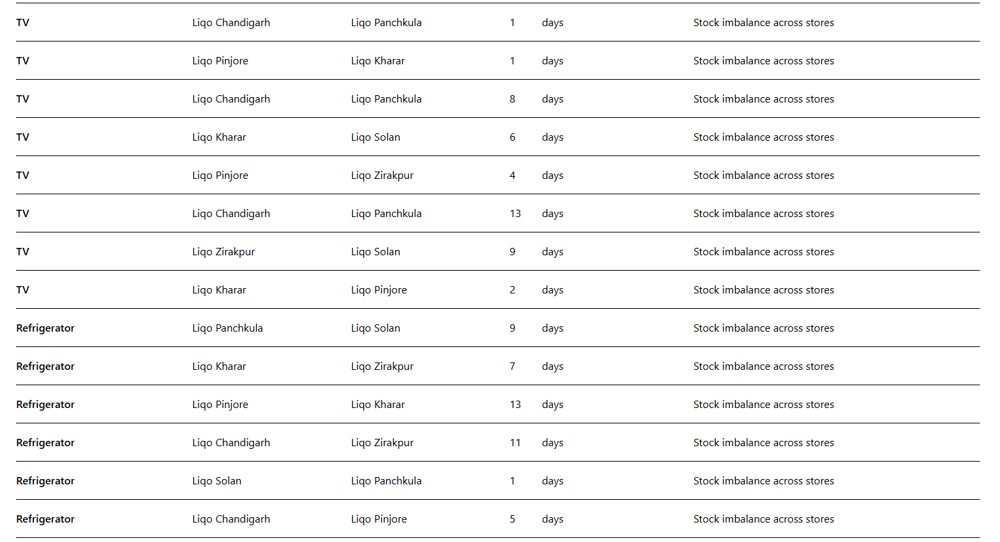

# 🧠 Liqo Inventory Intelligence

> A full-stack analytics platform that helps retailers optimize inventory distribution across stores using **data-driven insights and automated recommendations**.

---

## 🚀 Live Demo

🌐 Frontend (Vercel)  
https://liqo-inventory-intelligence-ep1q.vercel.app/login

⚙️ Backend (Render)  
https://liqo-inventory-intelligence.onrender.com

---

# 📊 Overview

Liqo Inventory Intelligence analyzes:

- 📦 Inventory levels
- 📈 Sales velocity
- 🏬 Store performance
- ⚠️ Deadstock risks

The system then generates **AI-driven redistribution recommendations** between stores.

This helps retailers:

- Reduce deadstock
- Improve inventory turnover
- Maximize profitability
- Make smarter stocking decisions

---

# 🖥️ Dashboard

## Main Dashboard



The dashboard provides:

- Revenue insights
- Inventory performance
- Store analytics
- Risk alerts

---

# ✨ Features

## 📈 Real-Time Analytics
Track key business metrics in real time.

- Revenue trends
- Store performance
- Category breakdown
- Inventory movement

---

## ⚠️ Deadstock Detection

Automatically detects products that are not selling.

Helps retailers:

- identify slow inventory
- reduce warehouse costs
- improve cash flow

---

## 🔁 Smart Redistribution

The system suggests inventory transfers between stores.

Example:

```
Store A → 120 units
Store B → 20 units

Demand detected at Store B
Recommendation: Transfer 40 units
```

---

## 🏬 Store Performance Insights

Compare stores based on:

- Sales velocity
- Inventory turnover
- Profit margins

---

## 📦 Inventory Visibility

Track inventory across locations.

Helps businesses:

- maintain optimal stock levels
- avoid stockouts
- prevent overstocking

---

# 🧱 System Architecture

```
Frontend (Next.js + React)
        │
        │ REST API
        ▼
Backend (Node.js + Express)
        │
        │ Prisma ORM
        ▼
PostgreSQL Database
```

---

# ⚙️ Tech Stack

## Frontend

- Next.js 14
- React
- TypeScript
- Tailwind CSS
- React Query
- Axios
- Recharts
- Lucide Icons

---

## Backend

- Node.js
- Express
- TypeScript
- Prisma ORM
- PostgreSQL
- Helmet
- Rate Limiting
- Cookie Authentication

---

## DevOps

- Vercel (Frontend deployment)
- Render (Backend deployment)
- PostgreSQL (Database)
- UptimeRobot (Backend monitoring)

---

# 📂 Project Structure

```
liqo-inventory-intelligence
│
├── backend
│   ├── routes
│   ├── controllers
│   ├── services
│   ├── middleware
│   ├── prisma
│   └── server.ts
│
├── frontend
│   ├── src
│   │   ├── app
│   │   │   ├── dashboard
│   │   │   ├── inventory
│   │   │   ├── deadstock
│   │   │   ├── recommendations
│   │   │   └── login
│   │   │
│   │   ├── services
│   │   ├── types
│   │   ├── hooks
│   │   └── lib
│   │
│   ├── public
│   └── package.json
│
└── README.md
```

---

# 🔗 API Endpoints

Base API

```
/api/v2
```

---

## Authentication

```
POST /auth/login
POST /auth/guest
POST /auth/logout
```

---

## Dashboard

```
GET /dashboard
GET /dashboard/overview
```

Returns aggregated analytics data.

---

## Inventory

```
GET /inventory
GET /inventory/categories
```

---

## Deadstock

```
GET /deadstock
```

---

## Recommendations

```
GET /recommendations
```

---

# ⚡ Performance Optimizations

### Aggregated Dashboard API

Instead of multiple requests:

```
/dashboard/kpis
/dashboard/revenue
/dashboard/stores
```

The system uses one endpoint:

```
/dashboard/overview
```

This significantly improves performance.

---

### React Query Caching

Dashboard responses are cached for **5 minutes**.

Benefits:

- Faster page loads
- Reduced API calls
- Better user experience

---

### Skeleton Loaders

UI skeletons improve perceived performance while loading data.

---

# 🔐 Authentication Flow

1. User logs in
2. Backend sets authentication cookie
3. Frontend sends cookie with every request
4. Protected APIs verify session

Example:

```
POST /auth/login
```

---

# 🛠️ Setup Instructions

## 1️⃣ Clone Repository

```
git clone https://github.com/GauravDograa/Liqo-Inventory-Intelligence.git
```

```
cd Liqo-Inventory-Intelligence
```

---

# Backend Setup

```
cd backend
npm install
```

Create `.env`

```
DATABASE_URL=
JWT_SECRET=
PORT=5000
```

Run migrations

```
npx prisma migrate dev
```

Start backend

```
npm run dev
```

---

# Frontend Setup

```
cd frontend
npm install
```

Create `.env.local`

```
NEXT_PUBLIC_API_BASE_URL=http://localhost:5000/api/v2
```

Start frontend

```
npm run dev
```

---

# 📡 Monitoring

Backend uptime monitored using **UptimeRobot**

Monitored endpoint:

```
/health
```

---

# 📸 Screenshots

## Login Page



---

## Dashboard


---

## Recommendations



---

# 🧑‍💻 Author

**Gaurav Dogra**

GitHub  
https://github.com/GauravDograa

---

# © Copyright

Copyright © 2026 Gaurav Dogra.

All rights reserved.

This project and its source code are the intellectual property of **Gaurav Dogra**.  
Unauthorized copying, modification, distribution, or use of this software, via any medium, is strictly prohibited without prior permission from the author.

For permissions or inquiries, please contact:

**Gaurav Dogra**  
GitHub: https://github.com/GauravDograa

---
---

⭐ If you found this project useful, please consider **starring the repository**.
